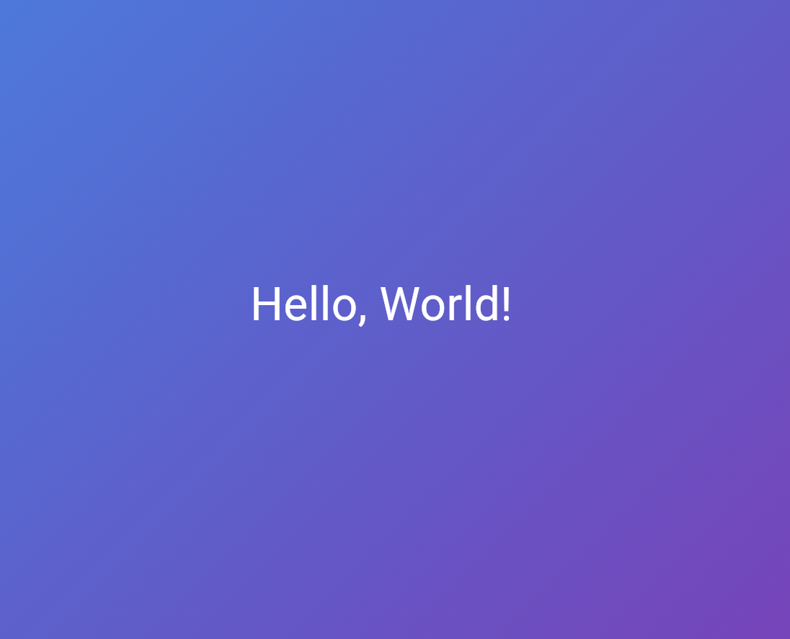

# Лабораторная работа №2. Знакомство с Flutter

Познакомиться с основным инструментом кроссплатформенной
разработки — Flutter. Создать и запустить первый Flutter-проект в браузере Chrome,
изучить структуру проекта и базовые концепции фреймворка — виджеты и дерево
виджетов.

## Основная информация

**ФИО**: Rudy Rudy Rudy

**Группа**: ИСП-233

**Дата**: 24.08.2077

[](https://github.com/RudySource?tab=repositories)

---

## Стек

- **Flutter:** 3.41.6
- **Dart:** 3.11.4
- **Платформа:** Web (Chrome)
- **IDE:** VS Code

## Скриншот приложения



## Как запустить

1. **Клонировать репозиторий**

```bash
git clone <URL_вашего_репозитория>
```

2. Перейти в папку проекта
   `cd Flutter_Lab2`
3. Установить зависимости

```
flutter pub get
```

4. Запустить в браузере

```
flutter run -d chrome
```

---

## Что изучили

- Создание Flutter-проекта и запуск в Chrome.
- Декларативный UI: дерево виджетов (MaterialApp → Scaffold → Container → Center → Text).
- Работа с DevTools и Flutter Inspector.
